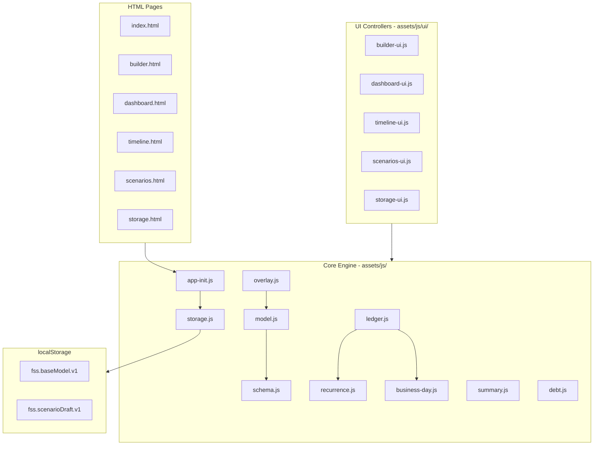
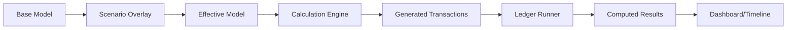

# Finance Scenario Simulator V1 - Implementation Plan

## Architecture Overview

## Data Flow

---

## Phase 1: Project Skeleton and Storage

Create the file structure and implement core storage/schema modules.**Files to create:**

- All 6 HTML pages with shared navigation and Bootstrap 5 dark theme
- [assets/css/app.css](assets/css/app.css) - Dark finance theme with accent colors
- [assets/js/app-init.js](assets/js/app-init.js) - Bootstrap app, detect page, load appropriate UI
- [assets/js/storage.js](assets/js/storage.js) - localStorage wrapper with `fss.baseModel.v1` and `fss.scenarioDraft.v1` keys
- [assets/js/schema.js](assets/js/schema.js) - JSON schema definition, validation, default factory

**Key implementation:**

- Dark theme using CSS variables for consistency
- Accent colors: emerald green for income, coral red for expenses, blue for transfers
- Navigation bar present on all pages with active state

---

## Phase 2: Calculation Engine MVP

Build the core financial calculation modules.**Files to create:**

- [assets/js/model.js](assets/js/model.js) - Base model CRUD operations, account/rule/oneOff management
- [assets/js/recurrence.js](assets/js/recurrence.js) - Expand rules into dated transactions (monthly_day, semimonthly_days, biweekly_anchor, weekly_dow)
- [assets/js/business-day.js](assets/js/business-day.js) - Weekend detection, next/prev business day adjustment
- [assets/js/ledger.js](assets/js/ledger.js) - Transaction generation pipeline, ledger runner with running balance
- [assets/js/summary.js](assets/js/summary.js) - Monthly summaries, safe surplus calculation (next_month_trough + buffer)

**Key algorithms:**

- Transaction generation: expand rules → apply business day adjustment → inject one-offs → sort by (date, priority, kind)
- Ledger: starting balance → sequential transaction application → track min/max/end balances

---

## Phase 3: Builder UI MVP

Implement the data builder interface for creating/editing the base model.**Files to create:**

- [assets/js/ui/builder-ui.js](assets/js/ui/builder-ui.js) - Accordion-based editor for all model sections

**Builder sections (accordion):**

1. Accounts - Add/edit/delete accounts (checking required)
2. Starting Balances - Date + amount per account
3. Income Rules - Recurring income with recurrence config
4. Expense Rules - Recurring expenses
5. Transfers - Inter-account moves, `followsRuleId` support
6. One-Offs - Single date transactions
7. Debts - Loan tracking with APR, min payment rule link
8. Settings - Forecast horizon, safe surplus config, display prefs

**Actions bar:** Validate | Save | Export JSON | Import JSON | Discard---

## Phase 4: Timeline View

Display the generated transaction ledger.**Files to create:**

- [assets/js/ui/timeline-ui.js](assets/js/ui/timeline-ui.js) - Ledger table with filters

**Features:**

- Table columns: Date | Name | Amount | Category | Balance | Source Rule
- Filter controls: month selector, category dropdown, source filter
- Danger day highlighting (balance below floor)
- Color coding: green rows for income, red for expense, blue for transfer
- Export to CSV button

---

## Phase 5: Dashboard with Charts

Summary cards and Chart.js visualizations.**Files to create:**

- [assets/js/ui/dashboard-ui.js](assets/js/ui/dashboard-ui.js) - Summary cards and chart rendering

**Components:**

- Month selector dropdown
- Summary cards: End Balance | Net Surplus | Minimum Balance | Safe Withdrawable
- Chart 1: Balance over time (line chart, 6-month default horizon)
- Chart 2: Monthly net surplus (bar chart)

**Chart.js config:** Dark theme compatible colors, responsive sizing---

## Phase 6: Scenario Lab

What-if scenario exploration without affecting base model.**Files to create:**

- [assets/js/overlay.js](assets/js/overlay.js) - Scenario ops processor (rule_amount_set, rule_disable, add_oneoff, etc.)
- [assets/js/ui/scenarios-ui.js](assets/js/ui/scenarios-ui.js) - Scenario editing interface

**Features:**

- Scenario banner when draft is active
- Operations panel: adjust income, disable rules, change dates, inject one-offs
- Side-by-side diff view: Base vs Scenario results
- Actions: Reset Scenario | Commit to Base

---

## Phase 7: Debt Module

Debt tracking and payoff projections.**Files to create:**

- [assets/js/debt.js](assets/js/debt.js) - APR calculations, payoff timeline projection

**Features:**

- Link debt to min payment expense rule
- Extra monthly payment configuration
- Lump sum payment scheduling
- Payoff date projection display

---

## Phase 8: Storage Page and Polish

Import/export interface and final polish.**Files to create:**

- [assets/js/ui/storage-ui.js](assets/js/ui/storage-ui.js) - Export/import/reset controls

**Features:**

- Export Base Model JSON (download)
- Export Base + Scenario JSON
- Import JSON (file picker with validation)
- Reset buttons: Base Only | Scenario Only | All Data
- Confirmation modals for destructive actions

---

## Dark Finance Theme Specification

**Color palette (CSS variables):**

- `--bg-primary`: #0d1117 (deep dark)
- `--bg-secondary`: #161b22 (card backgrounds)
- `--bg-tertiary`: #21262d (input backgrounds)
- `--text-primary`: #e6edf3
- `--text-muted`: #8b949e
- `--accent-income`: #3fb950 (green)
- `--accent-expense`: #f85149 (coral red)
- `--accent-transfer`: #58a6ff (blue)
- `--accent-warning`: #d29922 (amber)
- `--border-color`: #30363d

**Typography:** System font stack with monospace for numbers---

## Deliverables Checklist

| File | Purpose ||------|---------|| index.html | Home/status page || builder.html | Data model editor || dashboard.html | Summary + charts || timeline.html | Transaction ledger || scenarios.html | What-if lab || storage.html | Import/export/reset || assets/css/app.css | Dark theme styles |